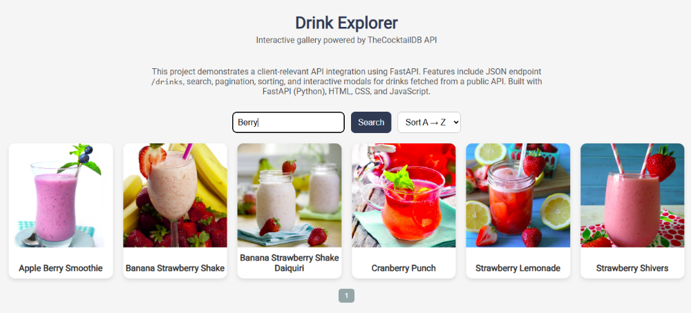
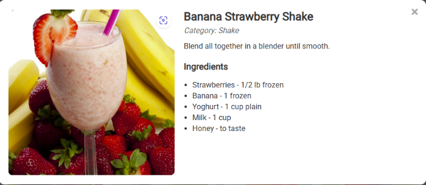

# Drink Explorer - FastAPI Project

This project demonstrates a client-relevant API integration using FastAPI. It features a JSON endpoint `/drinks`, dynamic search, pagination, sorting, and interactive modals for drinks fetched from a public API. Built with FastAPI (Python), HTML, CSS, and JavaScript.

---

## Features

- Fetch non-alcoholic drinks from a public API
- JSON endpoint `/drinks`
- Dynamic search by drink name
- Pagination with 6 items per page
- Sorting drinks A-Z or Z-A
- Interactive modal displaying:
  - Full drink image
  - Category
  - Instructions
  - Ingredients list

---

## Tech Stack

- Python 3.x
- FastAPI
- Requests
- HTML / CSS / JavaScript

---

## Project Structure

drink-explorer/
│── main.py # FastAPI backend
│── index.html # Frontend HTML
│── requirements.txt
│── .gitignore
│── README.md
│── screenshots/ # Folder for demo images

---

## Uses / Use Cases

- Demonstrates API integration in a real-world scenario
- Showcases dynamic frontend interactions (search, sort, pagination, modals)
- Portfolio-ready example for Upwork or other freelance clients
- Can serve as a template for future API-driven web applications

---

## 📸 Project Screenshots

---

## 👤 Author

**Eric Mutisya**  
Python Developer & Web Automation Freelancer  
[View My GitHub Projects](https://github.com/Ek-Coder-Tech)

---

## 📝 Notes

- Designed to be extendable.
- Future improvements could include:
  - User authentication
  - Saving favorite drinks
  - Deploying to a cloud platform for live demos
- Demonstrates professional, maintainable code practices suitable for freelance portfolios.

---

## 🙏 Acknowledgements

- [CocktailDB](https://www.thecocktaildb.com/) for providing the public drinks API
- FastAPI documentation and community resources

---

## 📄 License

MIT License

---

## 📬 Contact

For freelance inquiries, please reach out via [Upwork Profile](https://www.upwork.com/freelancers/~012558bab6232e8e65)
