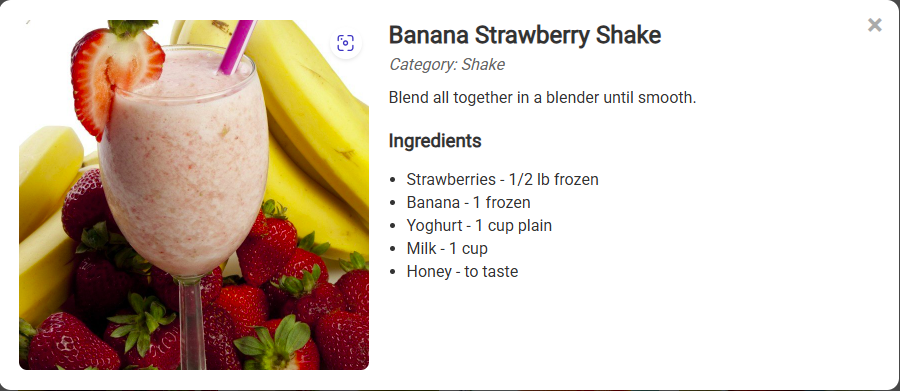

# Drink Explorer - FastAPI Project

Drink Explorer showcases a practical FastAPI integration with a public API. The project features a JSON endpoint <code>/drinks</code> (e.g., <code>/drinks?search=apple</code>), a dynamic gallery displaying drink cards with images and names, search and sort capabilities, pagination (6 drinks per page), and interactive modals presenting full images, categories, instructions, and ingredients. Built with FastAPI, HTML, CSS, and JavaScript, it demonstrates a complete client-relevant workflow for API-driven interfaces.

---

## Features

- Fetch non-alcoholic drinks from a public API
- JSON endpoint `/drinks`
- Dynamic search by drink name
- Pagination with 6 items per page
- Sorting drinks A-Z or Z-A
- Interactive modal displaying:
  - Full drink image
  - Category
  - Instructions
  - Ingredients list

---

## Tech Stack

- Python 3.x
- FastAPI
- Requests
- HTML / CSS / JavaScript

---

## Project Structure

drink-explorer/
│── main.py # FastAPI backend
│── index.html # Frontend HTML
│── requirements.txt
│── .gitignore
│── README.md
│── screenshots/ # Folder for demo images

---

## Uses / Use Cases

- Demonstrates API integration in a real-world scenario
- Showcases dynamic frontend interactions (search, sort, pagination, modals)
- Portfolio-ready example for Upwork or other freelance clients
- Can serve as a template for future API-driven web applications

---

## 📸 Project Screenshots

Main gallery with search functionality and drink cards;

Interactive modal with drink details:

---

## 👤 Author

**Eric M.**  
Python Developer & Web Automation Freelancer  
[View My GitHub Projects](https://github.com/Ek-Coder-Tech)

---

## 📝 Notes

- Designed to be extendable.
- Future improvements could include:
  - User authentication
  - Saving favorite drinks
  - Deploying to a cloud platform for live demos
- Demonstrates professional, maintainable code practices suitable for freelance portfolios.

---

## 🙏 Acknowledgements

- [CocktailDB](https://www.thecocktaildb.com/) for providing the public drinks API
- FastAPI documentation and community resources

---

## 📄 License

MIT License

---

## 📬 Contact

For freelance inquiries, please reach out via [Upwork Profile](https://www.upwork.com/freelancers/~012558bab6232e8e65)
